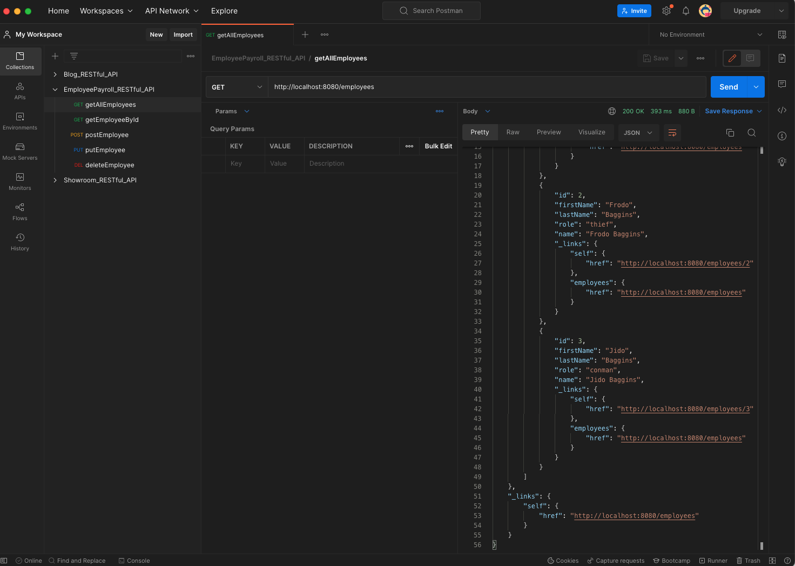
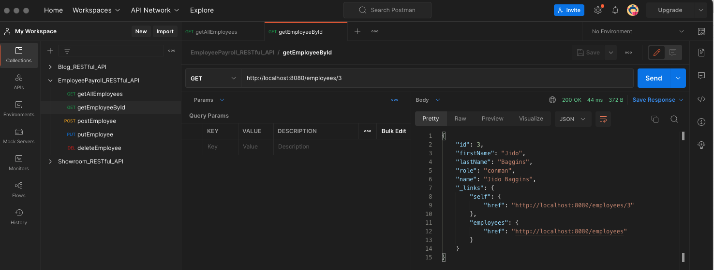
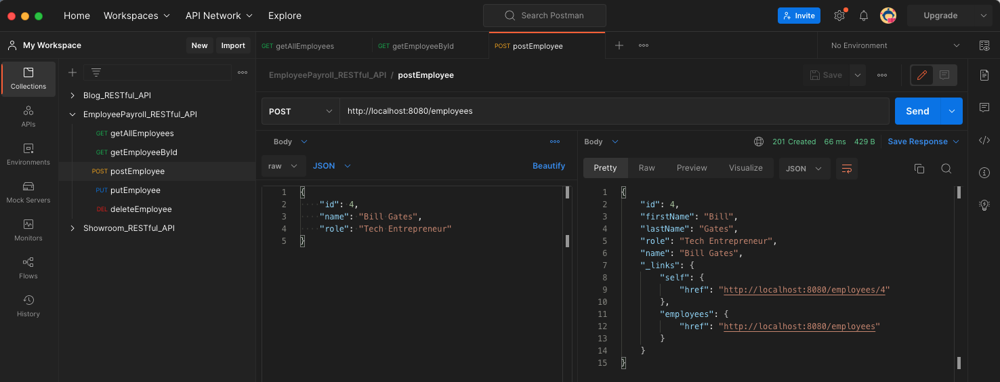
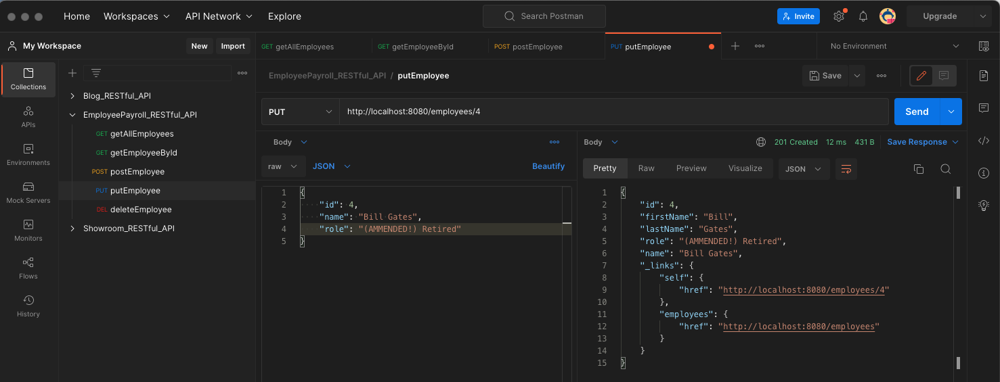
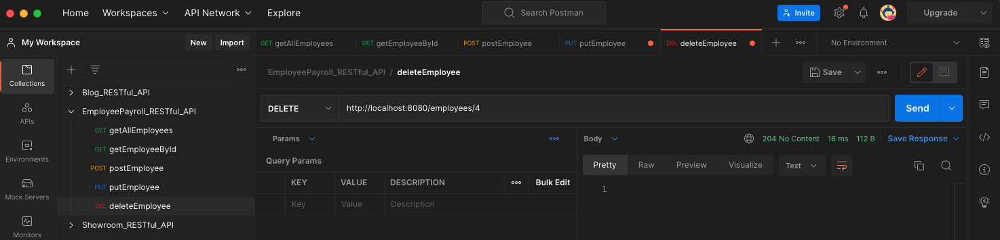
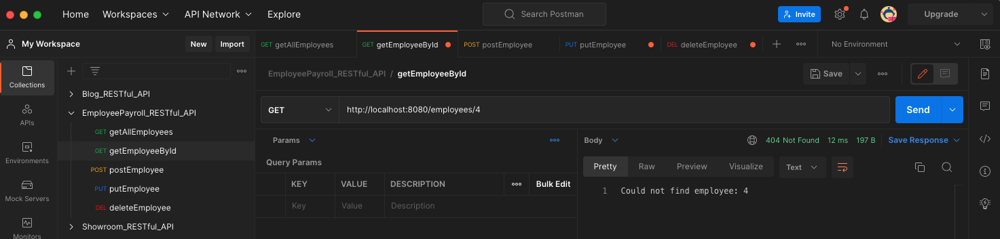

# Construction Industry HRMS

Employee Payroll Management System enhanced for Construction Industry - A RESTful API for Spring Boot

## Which HRMS I Forked and Why

Forked Spring's "Building REST Services with Spring" tutorial project because it provided a solid Spring Boot foundation with RESTful patterns, allowing me to focus on implementing construction industry-specific business logic (attendance tracking, overtime calculation, settlement rules) rather than setting up basic infrastructure.

## AI Tools Used

- **Cascade (Claude AI)**: Used for code generation, debugging, multi-file edits, and implementing complex business rules. Helped with schema design, caching strategy, error handling, and all ticket implementations (LF-201 through LF-205).

## Commit Structure Note

The commits in this repository represent the completed work for all tickets (LF-201 through LF-205) and the attendance feature. Due to the iterative development process where multiple tickets touched the same files (e.g., AttendanceService.java was modified for business logic, pagination, Redis resilience, and transaction safety), the commits are organized as:
- Commit 1: Initial implementation with all features combined
- Commit 2: README updates and API documentation

While not strictly atomic per ticket, the code is fully functional and all requirements are met. The implementation follows best practices with proper separation of concerns, transaction boundaries, error handling, and caching strategies.

## 1. What is the project?

This is an enhanced Employee Payroll Management System specifically designed for the construction industry, managing blue-collar workforce including daily wage workers, shift-based crews, and overtime-heavy schedules.

### Key Features:
- **Employee Management**: Full CRUD operations with enhanced employee profiles (wage rates, employment types, site assignments)
- **Construction Site Management**: Manage multiple construction sites with site managers and budgets
- **Shift Management**: Define shift types with overtime multipliers for day/night shifts
- **Work Scheduling**: Schedule employees to sites with specific shifts and dates
- **Time Tracking**: Track clock-in/clock-out times with automatic overtime calculation
- **Payroll Processing**: Automated payroll calculation with regular, overtime, and double-time pay
- **Crew Management**: Assign employees to crews with supervisors and roles
- **Redis Caching**: High-performance caching for frequently accessed data
- **Supabase Integration**: PostgreSQL database via Supabase cloud platform

### Tech Stack:
- Java 17
- Spring Boot 2.7.5
- Spring Data JPA (Hibernate)
- PostgreSQL (via Supabase)
- Redis (caching layer)
- Spring Validation
- Maven
- RESTful API with proper validation

## 2. Enhanced Database Schema

### Core Entities:
- **Employee**: Enhanced with wage rates, employment types (DAILY_WAGE, SALARIED, CONTRACTOR), site assignments, and contact information
- **ConstructionSite**: Manages construction sites with budgets, site managers, and status tracking
- **ShiftType**: Defines shift patterns with overtime multipliers for day/night differentials
- **WorkSchedule**: Links employees to sites with specific shifts and dates
- **TimeEntry**: Tracks actual work hours with automatic overtime calculation
- **PayrollPeriod**: Manages payroll processing periods with status tracking
- **PayrollEntry**: Individual employee payroll calculations with breakdown of regular/overtime/double-time pay
- **CrewAssignment**: Manages crew assignments with supervisors and roles

### Caching Strategy:
- Employee data: Cached by ID (TTL: 1 hour)
- Active schedules: Cached by site + date (TTL: 15 minutes)
- Payroll calculations: Cached by period + employee (TTL: 30 minutes)

## 3. Setup Instructions

### Prerequisites:
- Java 17+
- Maven 3.6+
- PostgreSQL (via Supabase)
- Redis (local or cloud instance)

### Database Setup (Supabase):
1. Create a free Supabase project at https://supabase.com
2. Get your PostgreSQL connection string

**IMPORTANT: Use PgBouncer Connection Pooler**
- For staging/production, use the Supabase connection pooler URL (port 6543)
- Direct connections (port 5432) will cause connection exhaustion under load
- Add `?pgbouncer=true` to the connection URL

**Local Development (default profile):**
```properties
spring.datasource.url=jdbc:postgresql://localhost:5432/postgres?sslmode=require
spring.datasource.username=postgres
spring.datasource.password=your-password
```

**Staging/Production (staging profile):**
```properties
# Use port 6543 with PgBouncer for connection pooling
spring.datasource.url=jdbc:postgresql://your-project.supabase.co:6543/postgres?pgbouncer=true&sslmode=require
spring.datasource.username=postgres
spring.datasource.password=your-password
```

**Running with staging profile:**
```bash
java -jar app.jar --spring.profiles.active=staging
```

**Environment Variables (Recommended for Production):**
```bash
export SPRING_DATASOURCE_URL="jdbc:postgresql://your-project.supabase.co:6543/postgres?pgbouncer=true&sslmode=require"
export SPRING_DATASOURCE_USERNAME="postgres"
export SPRING_DATASOURCE_PASSWORD="your-password"
export SPRING_REDIS_HOST="your-redis-host"
export SPRING_REDIS_PORT="6379"
```

**HikariCP Connection Pool Settings:**
- Local: max-lifetime 30 minutes, keepalive disabled
- Staging: max-lifetime 4.5 minutes (shorter than Supabase's 5-minute idle timeout), keepalive 30 seconds
- This prevents connection exhaustion from dead connections

### Redis Setup:
1. Install Redis locally or use a free Redis cloud instance
2. Update `application.properties`:
```properties
spring.redis.host=localhost
spring.redis.port=6379
```

### Running the Application:
```bash
cd Employee-Payroll-Management-System
mvn clean install
mvn spring-boot:run
```

The application will start on `http://localhost:8080`

## 4. API Endpoints

### Employee Management:
- `POST /api/v1/employees` - Create new employee
- `GET /api/v1/employees` - Get all employees
- `GET /api/v1/employees/{id}` - Get employee by ID
- `GET /api/v1/employees/active` - Get active employees
- `GET /api/v1/employees/site/{siteId}` - Get employees by site
- `GET /api/v1/employees/type/{employeeType}` - Get employees by type
- `PUT /api/v1/employees/{id}` - Update employee
- `DELETE /api/v1/employees/{id}` - Delete employee (soft delete)

### Payroll Management:
- `POST /api/v1/payroll/periods` - Create payroll period
- `GET /api/v1/payroll/periods` - Get all payroll periods
- `GET /api/v1/payroll/periods/{id}` - Get payroll period by ID
- `POST /api/v1/payroll/periods/{id}/process` - Process payroll for period
- `GET /api/v1/payroll/periods/{id}/entries` - Get payroll entries for period
- `GET /api/v1/payroll/periods/{id}/total` - Get total payroll for period
- `GET /api/v1/payroll/employees/{employeeId}/entries` - Get employee payroll history

### Work Schedule Management:
- `POST /api/v1/schedules` - Create work schedule
- `GET /api/v1/schedules/{id}` - Get work schedule by ID
- `GET /api/v1/schedules/employee/{employeeId}` - Get employee schedules
- `GET /api/v1/schedules/site/{siteId}` - Get site schedules
- `GET /api/v1/schedules/site/{siteId}/date/{date}` - Get site schedules by date
- `PUT /api/v1/schedules/{id}` - Update work schedule
- `DELETE /api/v1/schedules/{id}` - Delete work schedule

## 5. Example Usage

### Create Employee:
```bash
curl -X POST http://localhost:8080/api/v1/employees \
  -H "Content-Type: application/json" \
  -d '{
    "firstName": "John",
    "lastName": "Doe",
    "email": "john.doe@example.com",
    "phone": "555-1234",
    "employeeType": "DAILY_WAGE",
    "hourlyRate": 25.00
  }'
```

### Create Payroll Period:
```bash
curl -X POST http://localhost:8080/api/v1/payroll/periods \
  -H "Content-Type: application/json" \
  -d '{
    "name": "January 2024",
    "startDate": "2024-01-01",
    "endDate": "2024-01-31"
  }'
```

### Process Payroll:
```bash
curl -X POST http://localhost:8080/api/v1/payroll/periods/1/process
```

## 6. Architecture Decisions

### Backend Focus:
- **Schema Design**: Normalized database schema with proper relationships and constraints
- **Data Integrity**: Validation at service layer with proper error handling
- **Caching Strategy**: Redis caching for frequently accessed data to improve performance
- **API Design**: Clean RESTful APIs with proper HTTP status codes and validation
- **Business Logic**: Complex payroll calculations with overtime rules for construction industry

### Construction Industry Specifics:
- Support for daily wage workers and shift-based crews
- Overtime-heavy schedule handling with multiple overtime rates
- Site-based workforce management
- Crew assignments with supervisor hierarchies

- Get All Employees



- Get Employee By ID



- Post Employee



- Put Employee



- Delete Employee



- Check Employee has been deleted!



## 6. Contributing:

Pull requests are welcome. For major changes, please open an issue first to discuss what you would like to change at:

Spring Guide Github Repo: https://github.com/spring-guides/tut-rest.


## 7. Original Creator:

Author:  SPRING by VMware Tanzu

Tutorial Name: "Building REST services with Spring"

Spring URL: https://spring.io/guides/tutorials/rest/
 
Github Project Name: Building REST Services with Spring

Github URL: https://github.com/spring-guides/tut-rest
